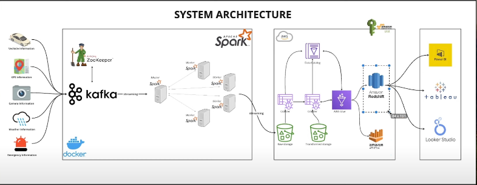
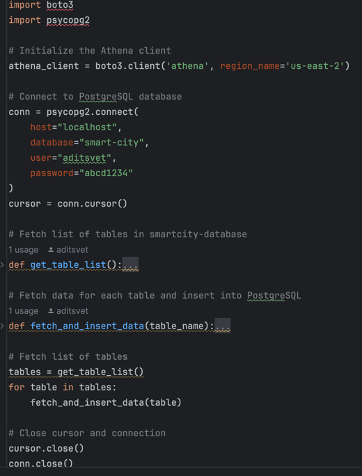

# smart-city-realtime-data-Engineering

This project aims to track details from one point (London) to another point (Birmingham) by generating data for specific topics using Apache Kafka. The generated data includes information related to emergencies, GPS coordinates, traffic conditions, vehicle details, and weather updates.

## Prerequisites / Technology Used
- **macOS**: [Install Docker Desktop](https://docs.docker.com/desktop/).
- Programming Language - Python
- Apache Kafka
- Apache Spark
- Amazon Web Services (AWS)
  - S3
  - Glue
  - Crawler
  - Athena
- Postgres SQL
- Tableau
- Datagrip

## Getting Started
### Architecture


### Kafka Topics
- "emergency_data"
- "gps_data"
- "traffic_data"
- "vehicle_data"
- "weather_data"
### Data Generation
- Data for the specified topics is generated at each timestamp.
- The data is encapsulated into JSON objects and sent to a Kafka producer.


### Data Processing
- Kafka partitions and distributes the data based on topics.
- Apache Zookeeper manages the coordination between producers and consumers.


### Data Processing with Spark
- Utilizes Apache Spark for data processing.
- Two Spark workers are employed to process the data.


### Storage
- Processed data is stored in an S3 bucket.


### Data Pipeline
- Crawlers are used to extract data from S3 and feed it into AWS Glue.


### Data Cleaning For Visualization
- Python scripts are utilized to scrape data from Athena.

- Data is then cleaned and converted into a PostgreSQL table
```sql
DROP TABLE IF EXISTS route_information;

CREATE TABLE route_information AS
SELECT 
    to_timestamp(v.timestamp, 'YYYY-MM-DD HH24:MI:SS.US') AS timestamp,
    CASE
        WHEN v.location ~ '^\[\d+(\.\d+)?,\s*-?\d+(\.\d+)?\]$'
        THEN split_part(trim(']' from trim('[' from v.location)), ',', 1)::numeric
        ELSE NULL
    END AS latitude,
    CASE
        WHEN v.location ~ '^\[\d+(\.\d+)?,\s*-?\d+(\.\d+)?\]$'
        THEN split_part(trim(']' from trim('[' from v.location)), ',', 2)::numeric
        ELSE NULL
    END AS longitude,
    CASE
        WHEN v.speed ~ '^\d+(\.\d+)?$'
        THEN v.speed::double precision
        ELSE NULL
    END AS speed,
    v.direction AS direction,
    e.type AS incident_type,
    e.status AS incident_status,
    w.weathercondition AS weather_condition
FROM
    vehicle_data v
LEFT JOIN
    emergency_data e ON v.timestamp = e.timestamp AND v.location = e.location
LEFT JOIN
    weather_data w ON v.timestamp = w.timestamp AND v.location = w.location;


SELECT * FROM route_information
ORDER BY timestamp;
```

### Visualization
- Connected the postgresSQL to Tableau as Data Source

- Dashboard


### Commands
- Bucket Policy
```bash
{
    "Version": "2012-10-17",
    "Statement": [
        {
            "Effect": "Allow",
            "Principal": "*",
            "Action": [
                "s3:GetObject",
                "s3:PutObject",
                "s3:PutObjectAcl"
            ],
            "Resource": "arn:aws:s3:::smart-city-streaming-data-aditsvet/*"
        }
    ]
}
```
- Delete/List topics from Kafka
```bash 
kafka-topics --delete --topic emergency_data --bootstrap-server broker:29092
kafka-topics --delete --topic gps_data --bootstrap-server broker:29092
kafka-topics --delete --topic weather_data --bootstrap-server broker:29092
kafka-topics --delete --topic traffic_data --bootstrap-server broker:29092
kafka-topics --delete --topic vehicle_data --bootstrap-server broker:29092
kafka-topics --list --bootstrap-server broker:29092
```
- Docker execution command
```bash
docker exec -it smart-city-realtime-spark-master-1 spark-submit \
--master spark://spark-master:7077 \
--packages org.apache.spark:spark-sql-kafka-0-10_2.12:3.5.0,org.apache.hadoop:hadoop-aws:3.3.6,\
com.amazonaws:aws-java-sdk:1.11.469 \
jobs/spark-city.py
```
- How to exclude folder not to get crawled
```bash
_spark_metadata
_spark_metadata/**
**/_spark_metadata
**spark_metadata**
```

## Authors

* **Adnan Ali** - Project Lead & Main Contributor

As a Master's degree holder in Computer Science from UMass Boston, I have utilized my expertise in machine learning and computer vision to spearhead the development of this integrated model system. 
With a keen eye for innovative solutions, I have orchestrated the seamless fusion of posture analysis and logo detection models, showcasing state-of-the-art techniques in the realm of AI.

Connect :
- [GitHub](https://github.com/adi-tsvet)
- [LinkedIn](https://www.linkedin.com/in/adi-tsvet/) 

## References
1. Video tutorial - https://www.youtube.com/watch?v=Vv_fvwF41_0
2. Source Code: https://www.buymeacoffee.com/yusuf.ganiyu/source-code-smart-city-end-end-realtime-data-engineering-project
3. Docker Compose Documentation: https://docs.docker.com/compose/
4. Apache Kafka Official Site: https://kafka.apache.org/
5. Apache Spark Official Site: https://spark.apache.org/
6. Confluent Docs: https://docs.confluent.io/home/overview.html
7. S3 Documentation: https://docs.aws.amazon.com/s3/
8. AWS IAM Documentation: https://docs.aws.amazon.com/IAM/latest/UserGuide/introduction.html

